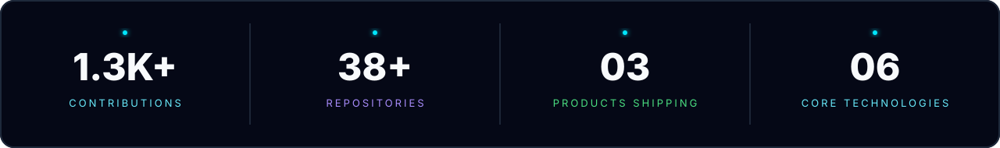
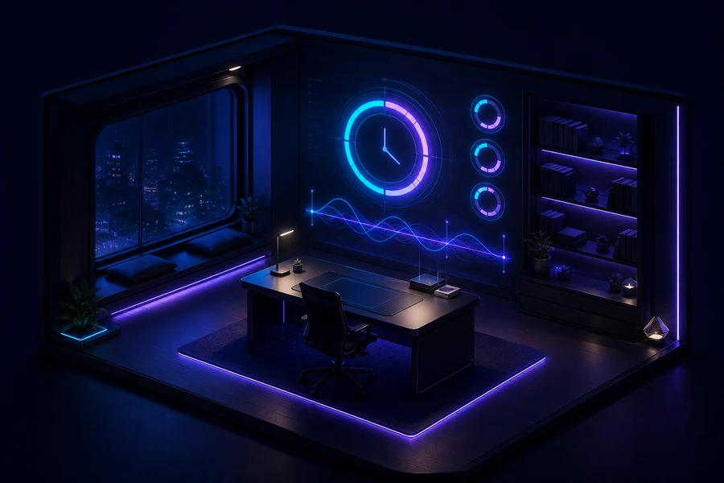
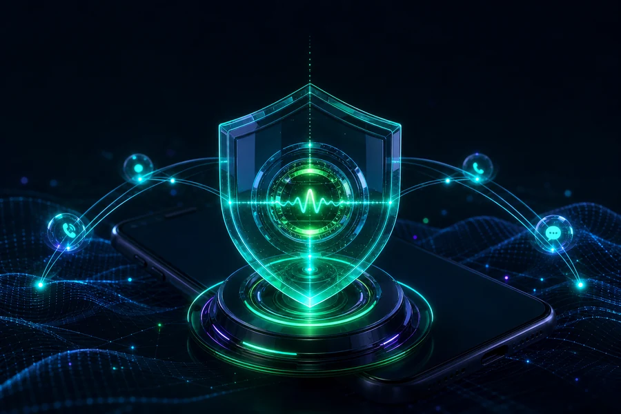
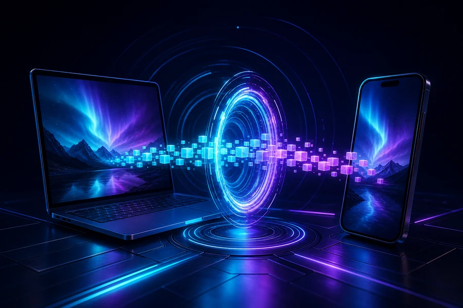

<picture>
  <source media="(prefers-color-scheme: dark)" srcset="./assets/hero-neon.svg">
  <source media="(prefers-color-scheme: light)" srcset="./assets/hero-neon.svg">
  
</picture>

  
  
  

## `// ACTIVE PRODUCTS`

<table>
  <tr>
    <td width="33%" valign="top">
      
      <h3>01 // STUDILAPSE</h3>
      
<code>● SHIPPING</code>

      
Focused study rooms, routines, visible progress, and playful spatial experiences.

      
<code>Flutter</code> <code>Dart</code> <code>3D</code>

    </td>
    <td width="33%" valign="top">
      
      <h3>02 // PRIVATENUM</h3>
      
<code>● SHIPPING</code>

      
Privacy-first mobile communication designed around safer, resilient flows.

      
<code>TypeScript</code> <code>React Native</code> <code>Realtime</code>

    </td>
    <td width="33%" valign="top">
      
      <h3>03 // PIXELPORT</h3>
      
<code>● SHIPPING</code>

      
Fast device pairing and direct sharing through short, frictionless interactions.

      
<code>JavaScript</code> <code>WebRTC</code> <code>Mobile</code>

    </td>
  </tr>
</table>

## `// SIGNAL STACK`

  

 

| CHANNEL | CAPABILITY | OPERATING PRINCIPLE |
| :-- | :-- | :-- |
| `MOBILE` | Flutter · React Native | Build the real user flow before polishing the abstraction |
| `REALTIME` | WebRTC · Supabase | Make connection, recovery, and failure states visible |
| `SPATIAL` | Three.js · Interactive 3D | Keep motion purposeful and performance measurable |
| `RELEASE` | Android · Docker · CI | Separate local proof from actual release readiness |

## `// CONTRIBUTION SIGNAL`

<picture>
  <source media="(prefers-color-scheme: dark)" srcset="https://raw.githubusercontent.com/fsnabajura/fsnabajura/output/github-contribution-grid-snake-dark.svg">
  <source media="(prefers-color-scheme: light)" srcset="https://raw.githubusercontent.com/fsnabajura/fsnabajura/output/github-contribution-grid-snake.svg">
  
</picture>

 

  <code>BUILD</code> ◈ <code>SHIP</code> ◈ <code>LEARN</code> ◈ <code>REPEAT</code>
    
  TRANSMISSION FROM SEOUL · PRODUCT SYSTEMS ONLINE

