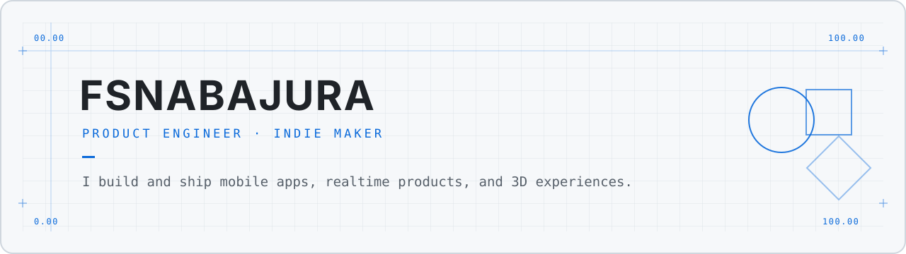

<picture>
  <source media="(prefers-color-scheme: dark)" srcset="./assets/hero-dark.svg">
  <source media="(prefers-color-scheme: light)" srcset="./assets/hero-light.svg">
  
</picture>

 

  <strong>Building useful products from the first sketch to the shipped release.</strong>
   
  Mobile apps · Realtime systems · 3D experiences

 

## Currently shipping

<table>
  <tr>
    <td width="33%" valign="top">
      <h3>◫ Studilapse</h3>
      
A focused study experience built around rooms, routines, and visible progress.

      <code>Flutter</code> <code>Dart</code> <code>Mobile</code>
    </td>
    <td width="33%" valign="top">
      <h3>▣ PrivateNum</h3>
      
A privacy-first mobile product designed for safer communication.

      <code>TypeScript</code> <code>React Native</code> <code>Realtime</code>
    </td>
    <td width="33%" valign="top">
      <h3>◇ PixelPort</h3>
      
A direct sharing experience connecting devices through short, simple flows.

      <code>JavaScript</code> <code>WebRTC</code> <code>Mobile</code>
    </td>
  </tr>
</table>

## Selected work

|  | Product | What I care about |
| :-- | :-- | :-- |
| `01` | **Studilapse** | Calm interaction design, reliable study sessions, and playful spatial experiences |
| `02` | **PrivateNum** | Privacy, secure communication flows, and production-ready mobile delivery |
| `03` | **PixelPort** | Fast device pairing, resilient realtime connections, and frictionless sharing |
| `04` | **3D Experiments** | Three.js scenes, interactive tools, and browser-based spatial interfaces |

## Toolkit

`TypeScript` &nbsp; `Flutter` &nbsp; `React Native` &nbsp; `Three.js` &nbsp; `Supabase` &nbsp; `Docker`

## How I build

- **Product first** — start with the user flow, then choose the smallest reliable system.
- **End to end** — connect interface, runtime, backend, release checks, and operations.
- **Ship and learn** — validate in the real viewport and keep release readiness explicit.

 

  BUILD / SHIP / LEARN / REPEAT

